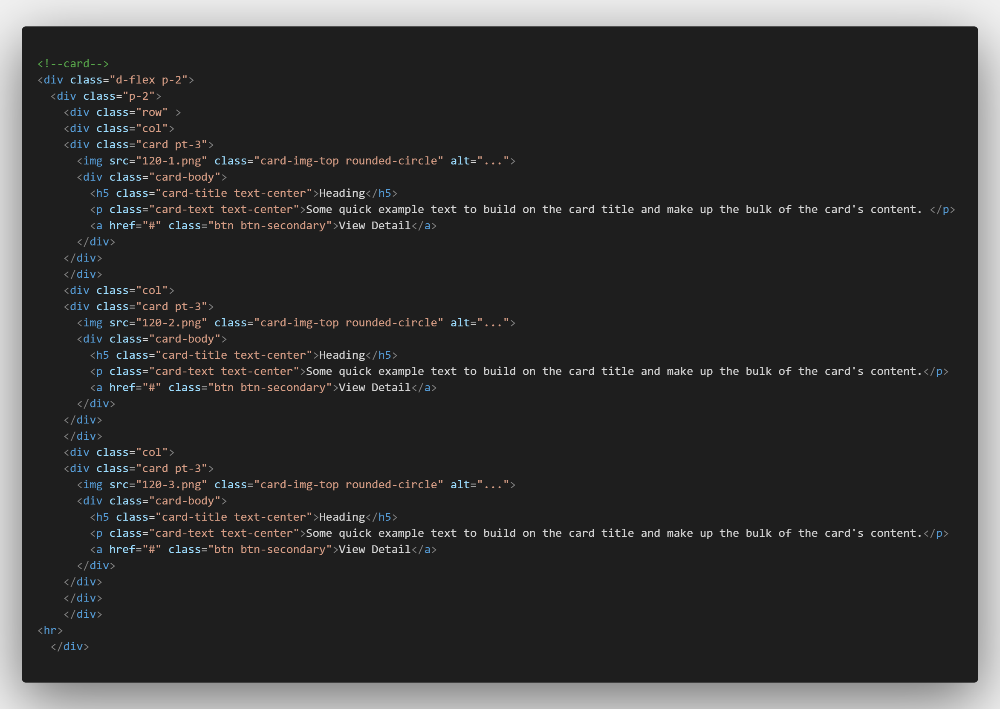
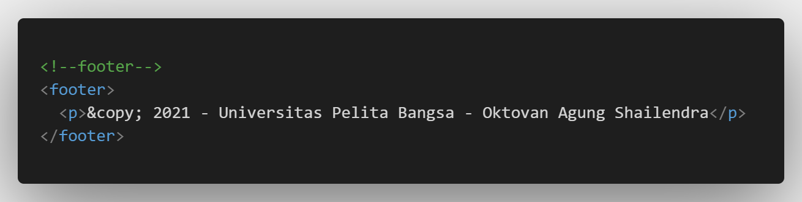

| Nama  | Oktovan Agung Shailendra|
|-------|-------------------------|
|NIM    |312010131                |
| Kelas | TI.20.A.1               |

---

## Langkah-Langkah Praktikum

## Membuat folder baru dengan nama **lab6_css_framework** dan, buat file HTML dengan nama **layoutweb.html**.

## Membuat layout web sederhana
Disini saya menggunakan css framework yaitu Twitter Bootsrtap dengan mengakses web https://getbootstrap.com. Disini saya menggunakan bootsrtap 4.

## Membuat Navigasi.
Untuk membuat navigasi dengan menggunakan code seperti berikut:

Maka akan seperti ini hasilnya

## Membuat Jumbotron
Jumbotron atau area besar pada Bootstrap yang umumnya digunakan untuk menampilkan sebuah informasi tertentu. Untuk membuatnya bisa dengan code berikut :

## Membuat Cards
Cards disini digunakan untuk membuat body content. Sebelum itu kolom akan dibagi dua untuk bagian selanjutnya. Untuk membaginya menggunakan `display flex`.

Hasilnya akan seperti ini,

Untuk mengatur ukuran gambar menggunakan CSS sehingga hasilnya akan seperti berikut.

## list Group
Selanjutnya menambahkan list group widget disamping kanan kolom card yang sudah dipersiapkan sebelumnya.

Sehingga hasilnya akan jadi seperti berikut.

## Body Konten
Pada bagian body konten ini masih menggunakan card seperti sebelumnya.

Hasilnya akan seperti ini.

## Footer
Selanjutnya menambahkan footer pada bagian akhir atau bagian paling bawah.

CSS untuk merubah tampilan atau stylenya

Dan hasilnya akan seperti berikut

## Tampilan Akhirnya Secara Penuh
